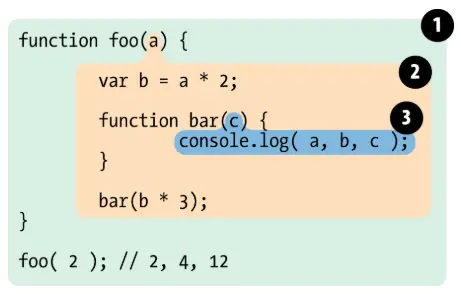

### 作用域

#### 全局作用域
- js文件内

#### 函数作用域
- 函数包裹

#### 块级作用域（ES6新增）
- let 申明
- {} 包裹

### 作用域链

#### 原理与定义
作用域链就好比一个 **有序列表** （或者说是**链条**），它包含了当前执行代码所能访问的所有*活动对象* 和 *变量环境*

用途：当*JavaScript查找一个变量*时，它会沿着**链条**，从*内部作用域* 向 *外部作用域* 逐步查找，直到找到该变量为止。如果都没有找到就会导致`ReferenceError`

#### 核心思想
1. 从内到外
2. 每个函数定义的时候，就确定了它的 *父级作用域*
3. 每个函数执行的时候，都会将自己的*变量环境* 移到**作用域链**的最前端
